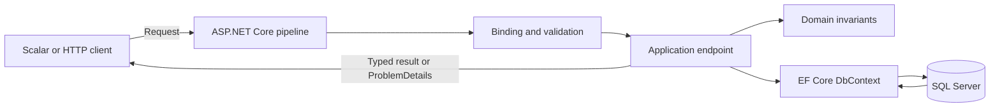

# Job Application Tracker .NET

[](https://github.com/SereMark/job-application-tracker-dotnet/actions/workflows/ci.yml)

A local REST API for managing job applications, follow-up actions, and status history.

Built with C# 14, .NET 10, ASP.NET Core Minimal APIs, EF Core, SQL Server 2025,
OpenAPI, Scalar, Docker Compose, xUnit, Testcontainers, and GitHub Actions.

## Features

- Create, view, update, and permanently delete job applications.
- Upload, replace, and download one PDF or DOCX resume (CV) per application.
- Track `Saved`, `Applied`, `Screening`, `Interview`, `Offer`, `Rejected`, and
  `Withdrawn` states with a complete status history.
- Search, filter, sort, and paginate applications.
- Record an optional next action and see overdue and upcoming work in the pipeline summary.
- Return consistent validation and error responses using `ProblemDetails`.
- Persist data in SQL Server with EF Core migrations, constraints, and indexes.
- Run the API and database together with Docker Compose.

## Quick start

The complete stack only requires Docker Desktop or Docker Engine with Docker Compose.

1. Copy `.env.example` to `.env`.
2. Set `MSSQL_SA_PASSWORD` to a strong password used only for local development.
3. Build and start the stack:

```bash
docker compose up --build -d
```

Once the API has started:

- API: <http://localhost:8080>
- Scalar API reference: <http://localhost:8080/scalar/v1>
- Readiness check: <http://localhost:8080/health/ready>

The API container waits for SQL Server to become healthy, then applies any pending
EF Core migrations before accepting requests.

Stop the containers without deleting the database volume:

```bash
docker compose down
```

## Using the API

Scalar provides an interactive view of the complete OpenAPI contract. The
[HTTP request collection](requests/JobApplicationTracker.Api.http) contains a runnable
example for every endpoint.

Create an application:

```http
POST /api/applications
Content-Type: application/json

{
  "companyName": "Example Ltd.",
  "positionTitle": ".NET Developer",
  "status": "Saved",
  "jobPostingUrl": "https://example.com/jobs/dotnet-developer",
  "source": "LinkedIn",
  "location": "Budapest",
  "nextActionDescription": "Review the job requirements",
  "nextActionDueAt": "2026-08-20T10:00:00Z"
}
```

Query the application list:

```http
GET /api/applications?search=.NET&status=Saved&page=1&pageSize=20&sortBy=updatedAt&sortDirection=desc
```

Change an application's status:

```http
PATCH /api/applications/{id}/status
Content-Type: application/json

{
  "status": "Applied",
  "note": "Application submitted"
}
```

Upload or replace the resume used for an application (maximum 5 MB):

```bash
curl --request PUT \
  --form "file=@/path/to/resume.pdf" \
  http://localhost:8080/api/applications/{id}/resume
```

Download the stored resume with its original file name:

```bash
curl --remote-header-name --remote-name \
  http://localhost:8080/api/applications/{id}/resume
```

### Endpoints

| Method | Route | Purpose |
|---|---|---|
| `POST` | `/api/applications` | Create an application and its initial history entry |
| `GET` | `/api/applications/{id}` | Get one application |
| `GET` | `/api/applications` | Search, filter, sort, and paginate applications |
| `PUT` | `/api/applications/{id}` | Replace editable details without changing status |
| `PUT` | `/api/applications/{id}/resume` | Upload or replace the PDF/DOCX resume used for an application |
| `GET` | `/api/applications/{id}/resume` | Download the stored resume |
| `PATCH` | `/api/applications/{id}/status` | Change status and append a history entry |
| `GET` | `/api/applications/{id}/status-history` | Get status history in chronological order |
| `DELETE` | `/api/applications/{id}` | Delete an application, status history, and resume |
| `GET` | `/api/applications/summary` | Get pipeline and next-action counts |
| `GET` | `/health/live` | Check whether the API process is running |
| `GET` | `/health/ready` | Check whether the API can reach SQL Server |

The list endpoint accepts `search`, `status`, `source`, `appliedFrom`, `appliedTo`,
`nextActionBefore`, `page`, `pageSize`, `sortBy`, and `sortDirection`. It defaults to
20 items ordered by `updatedAt desc`; the maximum page size is 100. Sort fields are
restricted to `updatedAt`, `createdAt`, `companyName`, `positionTitle`, `appliedOn`,
and `nextActionDueAt`.

## Design



The application is a feature-based modular monolith with one production project and
separate unit and integration test projects. This keeps the codebase small while retaining
clear boundaries between HTTP contracts, domain behavior, and persistence configuration.

Key decisions:

- Minimal APIs keep the HTTP layer compact and expose typed OpenAPI metadata.
- Endpoints use `ApplicationDbContext` directly. EF Core already provides repository and
  unit-of-work behavior, so a generic repository would only duplicate its API here.
- Domain methods normalize input and protect lifecycle rules independently of HTTP binding.
- UUID v7 identifiers are unique while remaining broadly time-orderable.
- `TimeProvider` makes timestamps and deadline calculations deterministic in tests.
- Read queries use no-tracking projections; sorting is restricted to an explicit allowlist.
- Status changes update the current state and append history in one database transaction.

`JobApplication` owns its current details and has a one-to-many relationship with
`StatusChange`. Status values are stored as readable strings. Database constraints protect
valid statuses and require the next-action description and deadline to be either both present
or both absent. An optional `ApplicationResume` uses the application id as both its primary key
and cascading foreign key. Keeping its binary content in a separate table prevents ordinary
application queries from loading files. Deleting an application cascades to its history and resume.

## Local development

Running the API directly requires the .NET 10 SDK in addition to Docker.

Start SQL Server only:

```bash
docker compose up -d --wait sqlserver
```

Store the connection string outside the repository. In PowerShell:

```powershell
dotnet user-secrets set --project src/JobApplicationTracker.Api `
  "ConnectionStrings:Database" `
  "Server=127.0.0.1,1433;Database=JobApplicationTracker;User ID=sa;Password=<same-password-as-.env>;Encrypt=True;TrustServerCertificate=True"
```

Apply migrations and run the API:

```bash
dotnet tool restore
dotnet ef database update --project src/JobApplicationTracker.Api
dotnet run --project src/JobApplicationTracker.Api
```

The development profile listens on <http://localhost:5090>; Scalar is available at
<http://localhost:5090/scalar/v1>. Automatic migration is disabled by default and enabled
explicitly by Compose through `Database__MigrateOnStartup=true`.

## Testing and CI

Run all tests from the repository root:

```bash
dotnet test
```

Unit tests cover domain invariants. Integration tests start a temporary SQL Server 2025
container, apply real migrations, host the complete API with `WebApplicationFactory`, and
give each test application factory an isolated database. The EF InMemory provider is not used.

The [CI workflow](.github/workflows/ci.yml) runs on pushes to `main` and on pull requests. It
checks formatting and analyzer rules, performs a warning-free Release build, runs unit and
SQL Server integration tests with coverage, uploads the test artifacts, and builds the Docker
image. It performs continuous integration only; it does not deploy the application.

## Data and security notes

The `sqlserver-data` volume survives `docker compose down` and container recreation.
Running `docker compose down --volumes` permanently removes that local database. A Docker
volume is not a backup; use SQL Server backup tooling before deleting the volume if the data
matters to you.

The Compose stack is intended for local, single-user development:

- Published ports bind only to `127.0.0.1`.
- `.env` is excluded from Git; direct-run connection strings are stored with .NET user secrets.
- The local database connection uses the SQL Server administrator account, encrypts traffic,
  and trusts the SQL Server container's certificate.
- The API does not include authentication, user isolation, TLS termination, or production
  secret management and should not be exposed to an untrusted network.
- Resumes can contain sensitive personal data. The upload feature is intended for this local,
  single-user setup until authentication and access control are added.

## Possible extensions

Natural next steps are a small web UI, authentication and per-user data isolation,
export or reminder workflows, and finally cloud hosting with a separate deployment pipeline.
Additional architectural layers or services should be introduced only when those features
create a concrete need for them.
